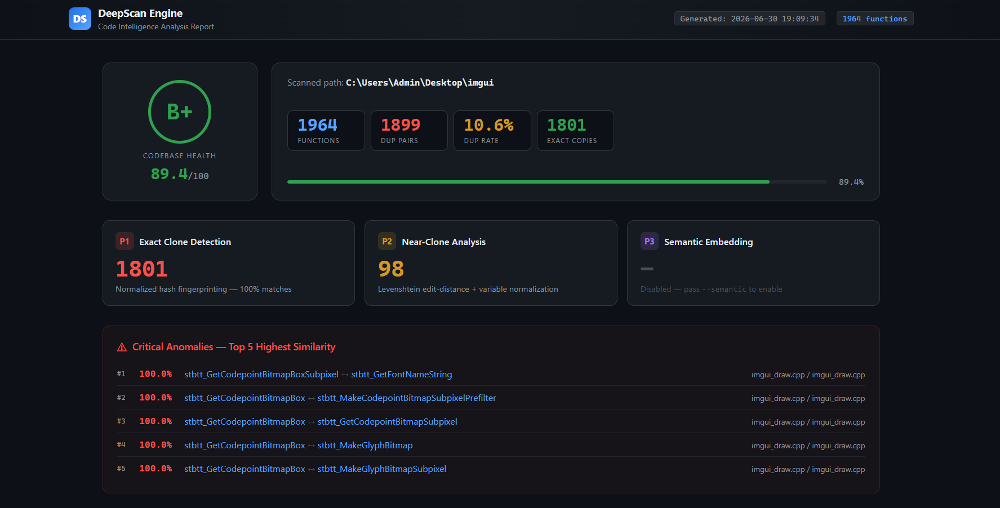
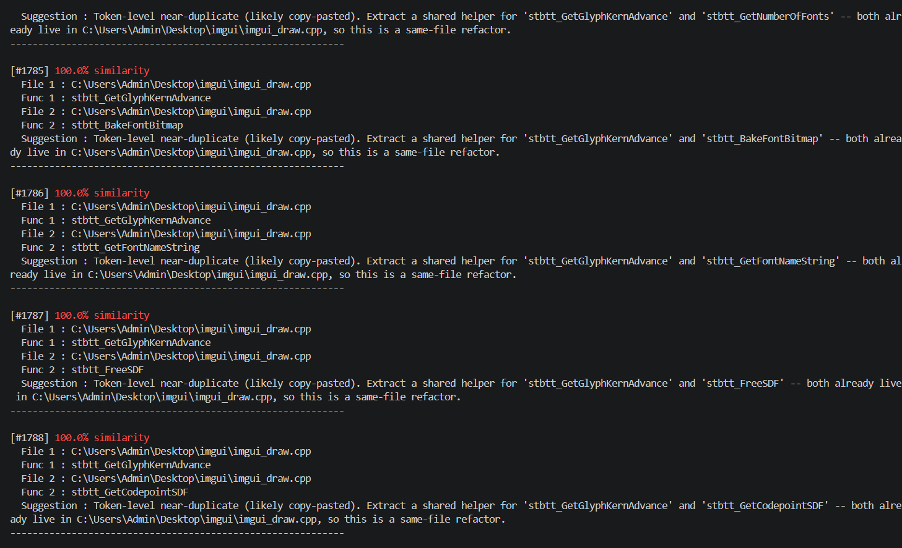
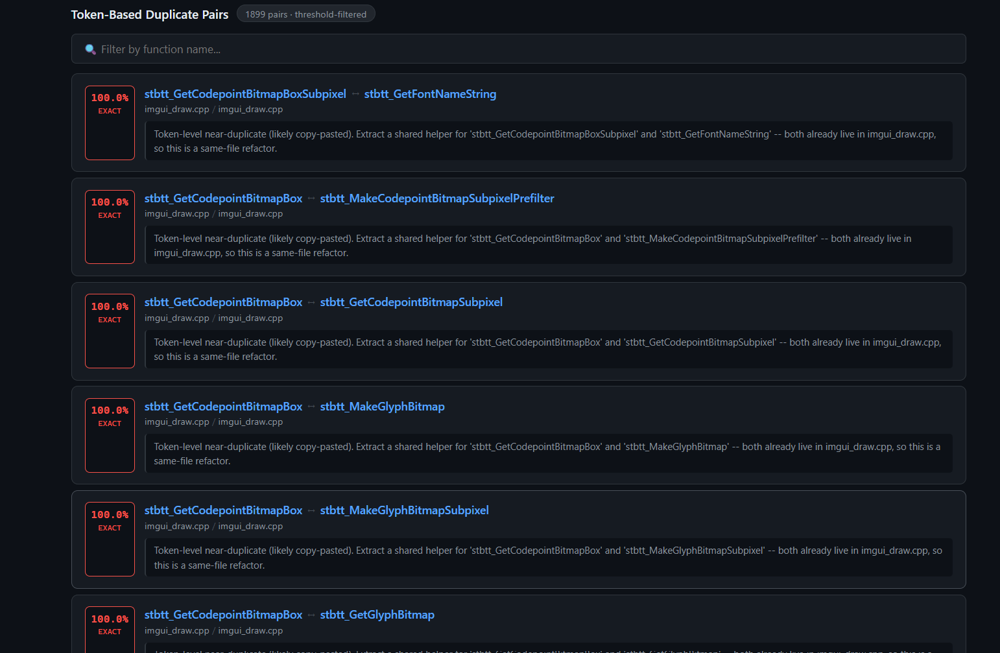
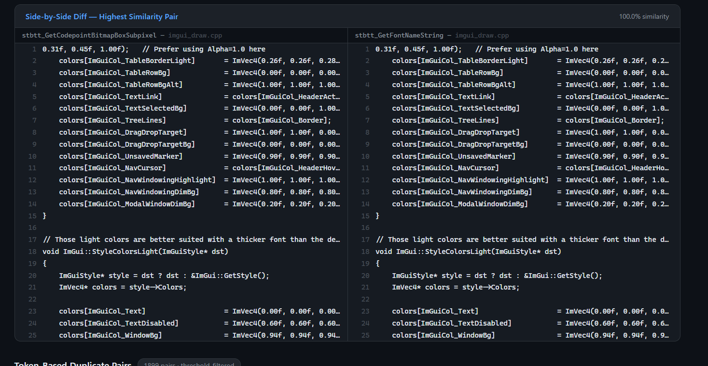

# AI-Generated Code Duplication Detector

A C++ command-line tool that scans a C++ codebase for duplicated functions — both exact copies and structurally near-identical code — using a multi-pass analysis pipeline that combines AST-based extraction, token-level edit-distance comparison, and semantic similarity via neural code embeddings.

Built as a portfolio project to demonstrate systems-level C++ engineering: libclang AST traversal, ONNX Runtime inference, algorithm design, real-world performance optimization, and clean CLI tooling.



---

## Features

- **AST-based function extraction** via libclang — understands C++ syntax rather than scanning raw text, so template functions, macro-annotated signatures, and overloaded operators are all handled correctly
- **Exact duplicate detection** via normalized hash fingerprinting (Pass 1) — whitespace, comments, and formatting differences are stripped before hashing, so reformatted copies still match
- **Near-duplicate detection** via Levenshtein edit distance with variable-name normalization (Pass 2) — renames like `int a` → `int b` don't hide copy-pasted code
- **Semantic duplicate detection** via CodeBERT embeddings + cosine similarity (Pass 3) — catches structurally different but functionally equivalent code that edit-distance misses
- **Z-score based semantic outlier flagging** — surfaces functions that are unusually similar to the rest of the codebase semantically
- **Per-pair refactoring suggestions** — tells you whether to extract a shared helper in the same file or move it to a common header across files
- **Codebase health score** (A+–F grade) — single metric combining duplication rate and semantic duplicate density, written into every report
- **Three output formats**: colored terminal output, standalone HTML report with a health badge, and machine-readable JSON
- **Config file support** — store common flags in a `.txt` file and pass it with `--config`
- **Git-only mode** (`--git-only`) — limits the scan to files tracked by git, skipping generated or vendored code

---

## How It Works

```
Source files
     │
     ▼
┌─────────────────────────────┐
│  libclang AST extraction    │  Parses each .cpp/.h file into an AST,
│  (clang_extractor.cpp)      │  visits FunctionDecl nodes, extracts body text
└────────────┬────────────────┘
             │  vector<Function>
             ▼
┌─────────────────────────────┐
│  Pass 1 – Exact matching    │  normalizeCode() strips comments/whitespace,
│  (detector.cpp)             │  hashes normalized body, groups by hash
└────────────┬────────────────┘
             │  unmatched functions
             ▼
┌─────────────────────────────┐
│  Pass 2 – Near-duplicate    │  normalizeVariables() replaces identifiers
│  Levenshtein comparison     │  with VAR_0/VAR_1/..., then computes
│  (detector.cpp)             │  Levenshtein edit distance with length-bound
│                             │  pruning and a minimum-length filter
└────────────┬────────────────┘
             │  all duplicate pairs
             ▼
┌─────────────────────────────┐
│  Pass 3 – Semantic          │  BPE tokenizes each body, runs CodeBERT
│  embedding similarity       │  via ONNX Runtime, computes cosine similarity
│  (embedder.cpp, similarity) │  on 768-dim embedding vectors
└────────────┬────────────────┘
             │  semantic duplicate pairs + z-scores
             ▼
┌─────────────────────────────┐
│  Reporting                  │  Health score, per-pair suggestions,
│  (reporter.cpp)             │  colored terminal / HTML / JSON output
└─────────────────────────────┘
```

---

## Requirements

| Dependency | Version | Purpose |
|---|---|---|
| MinGW-W64 / G++ | 14.2.0+ | C++17 compiler |
| CMake | 3.15+ | Build system |
| LLVM / libclang | Any recent | AST-based function extraction |
| ONNX Runtime | 1.26.0 | CodeBERT semantic inference |

> Tested on Windows 11 with MinGW-W64 G++ 14.2.0. LLVM and ONNX Runtime DLLs are copied automatically next to the executable by CMake post-build steps.

---

## Build

```powershell
git clone https://github.com/LameenCore/AI-Code-Duplication-Detector.git
cd AI-Code-Duplication-Detector
cmake -S . -B build
cmake --build build
```

The built executable and required DLLs end up in `build/`.

To run the test suite:

```powershell
cd build
.\tests.exe
```

---

## Usage

```
.\detector.exe --path <directory> [options]
```

### Options

| Flag | Description | Default |
|---|---|---|
| `--path <dir>` | Directory to scan | *(required)* |
| `--threshold <n>` | Minimum similarity % to report (0–100) | `80` |
| `--output <file>` | Save plain-text report to file | *(none)* |
| `--html <file>` | Save HTML report to file | *(none)* |
| `--json <file>` | Save JSON report to file | *(none)* |
| `--ignore <dir>` | Exclude a subdirectory (repeatable) | *(none)* |
| `--git-only` | Only scan files tracked by git | `false` |
| `--semantic` | Enable CodeBERT semantic analysis | `false` |
| `--config <file>` | Load flags from a config file | *(none)* |
| `--help` | Print usage | |

### Config file format

```ini
# example-config.txt
path=../src
threshold=90
output=report.txt
html=report.html
ignore=build
```

Pass it with:

```powershell
.\detector.exe --config ..\myconfig.txt
```

---

## Example

Scanning [Dear ImGui](https://github.com/ocornut/imgui) (a real-world 50k+ line C++ GUI library):

```powershell
.\detector.exe --path "C:\imgui" --threshold 90 ^
  --ignore backends --ignore examples --ignore misc ^
  --output ..\demo\imgui_report.txt ^
  --html   ..\demo\imgui_report.html ^
  --json   ..\demo\imgui_report.json
```

**Results**: 1,964 functions extracted, 1,899 duplicate pairs found at ≥90% similarity.



Each pair comes with a ranked similarity score and an actionable refactoring suggestion:



The HTML report also includes a side-by-side diff view of the highest-similarity pair so you can see exactly what was duplicated:



Full output saved in [`demo/`](demo/).

---

## Known Limitations

- **Short boilerplate functions**: setter/getter functions that follow identical patterns (e.g. `void SetX(...) { ctx->field = value; }`) can produce false-positive near-duplicate matches after variable-name normalization. Use `--threshold 90` or higher for large codebases to reduce noise.
- **Macro-expanded signatures**: functions whose signature is wrapped in macros (e.g. `IMGUI_API`) can cause libclang to resolve source offsets into a different file than the one being analyzed. Affected functions are skipped with a warning rather than crashing.
- **Near-duplicate comparison cap**: function bodies are capped at 500 normalized characters for Pass 2 to keep the O(n²) Levenshtein scan tractable on large codebases.
- **Windows only**: the current build assumes LLVM and ONNX Runtime paths on Windows. Porting to Linux/macOS requires updating the include/library paths in `CMakeLists.txt` and swapping `localtime_s` for `localtime_r` in `reporter.cpp`.

---

## Project Structure

```
├── src/
│   ├── main.cpp              # CLI argument parsing, top-level orchestration
│   ├── clang_extractor.cpp   # libclang AST traversal + function extraction
│   ├── detector.cpp          # Pass 1 (exact) + Pass 2 (near-duplicate) detection
│   ├── embedder.cpp          # ONNX Runtime CodeBERT inference
│   ├── similarity.cpp        # Cosine similarity + KNN lookup
│   ├── normalizer.cpp        # Code normalization (comments, whitespace, variables)
│   ├── reporter.cpp          # Health score + terminal/HTML/JSON output
│   ├── suggestion.cpp        # Per-pair refactoring suggestion generation
│   └── ...
├── include/                  # Header files
├── tests/
│   └── test_main.cpp         # Lightweight unit tests (no external framework)
├── tools/
│   └── export_codebert.py    # Exports CodeBERT from HuggingFace to ONNX
├── demo/                     # ImGui demo scan output + screenshots
├── myconfig.txt              # Example config file demonstrating --config flag
├── CMakeLists.txt
└── LICENSE
```

---

## License

MIT — see [LICENSE](LICENSE).
